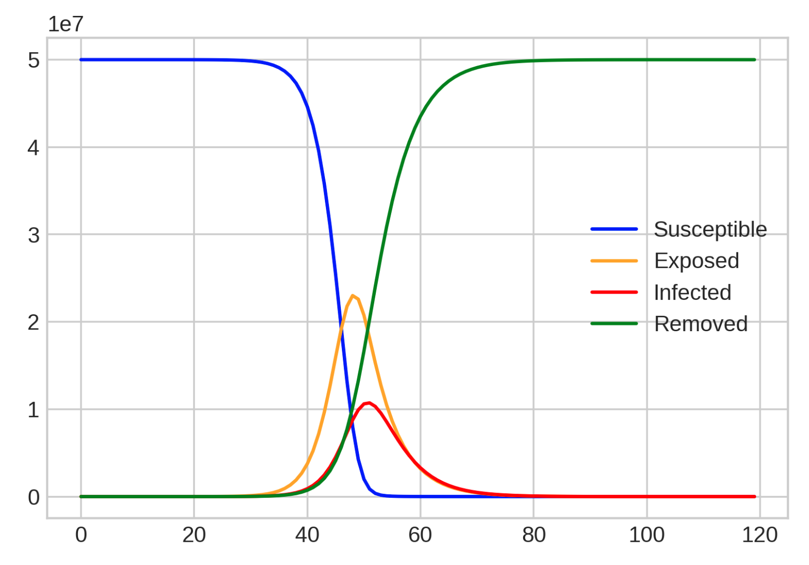
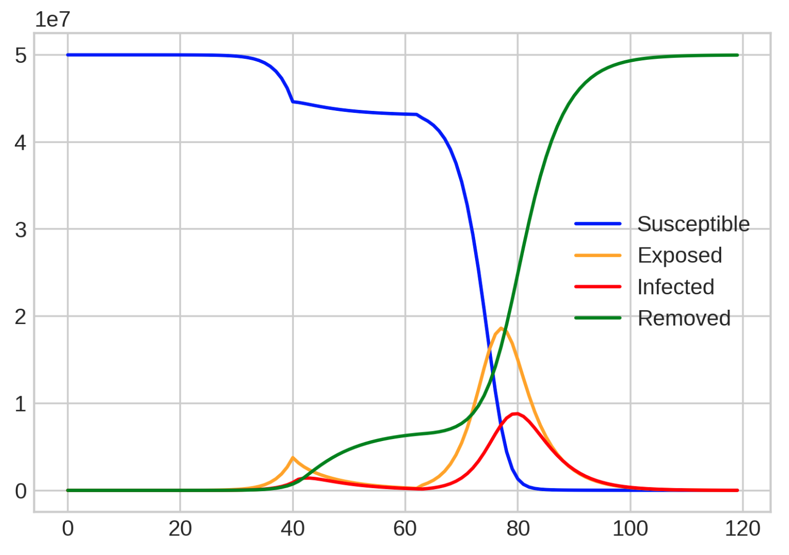
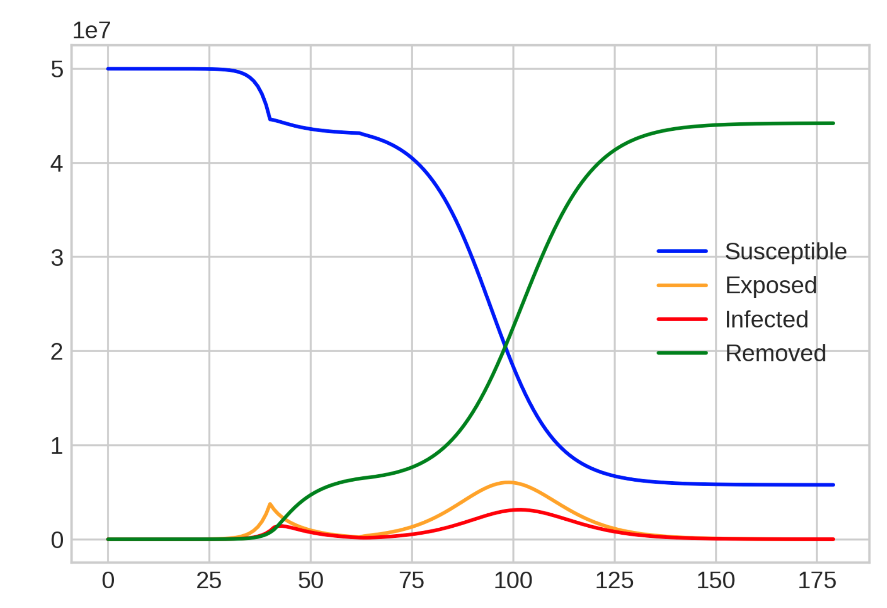
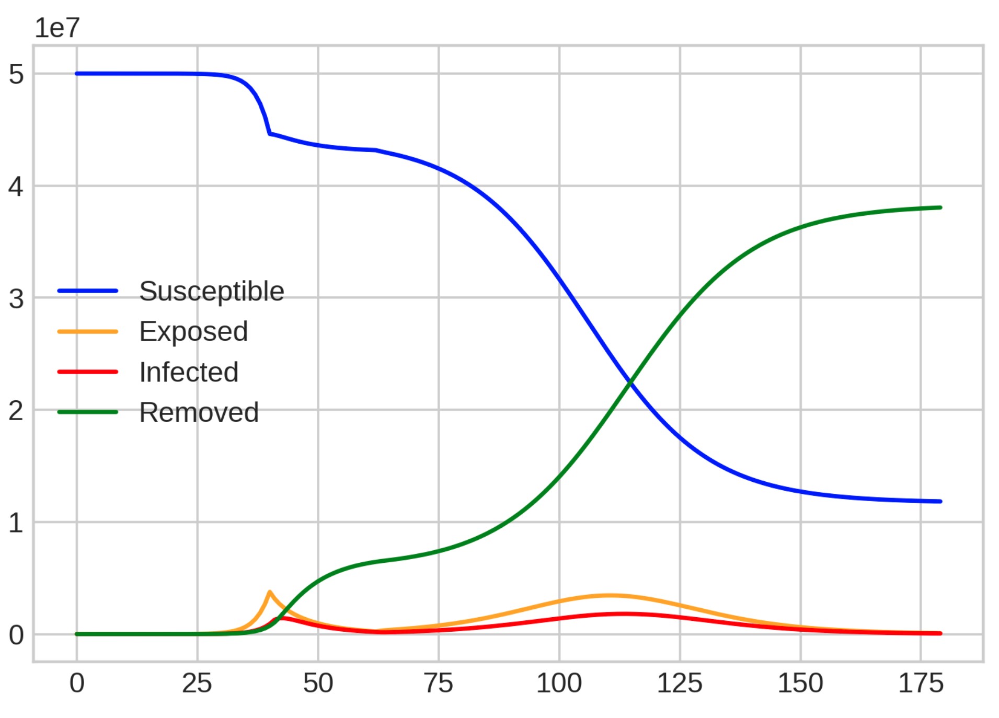
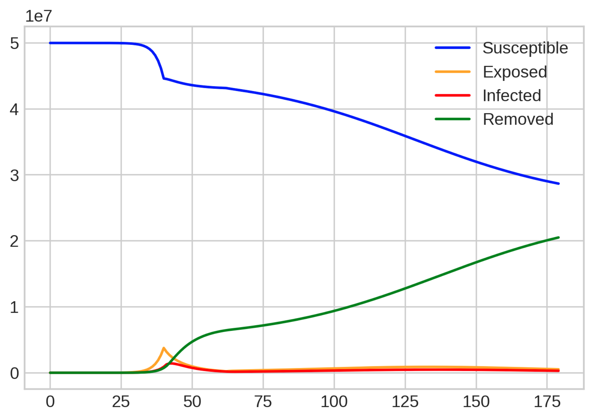

# Lock-Down SEIR Model

In this notebook, I'm investigating what the effect of a lock-down would be if people didn't keep the transmission rate low after the lock-down has taken place.

I have a few disclaimers:
 - I'm not a epidemiologist
 - This is an extremely basic SEIR model and I wouldn't quote the values from this for anything official
 - This is my first time using a Jupyter Notebook so please ignore any poor coding there

A couple of great places for reference:

 - [https://www.idmod.org/docs/hiv/model-seir.html](https://www.idmod.org/docs/hiv/model-seir.html) for an explanation on the model
 - [https://github.com/alsnhll/SEIR_COVID19](https://github.com/alsnhll/SEIR_COVID19) for an accurate model and far more detail

## Outputs

**No lock-down**

**Lock-down then no intervention**

**Lock-down and Intervention**

Assuming our behaviour changes after the lock-down  we may be able to flatten the curve. I've got graphs for different reproduction rates:

_R = 0.9_

_R = 0.7_

_R = 0.5_

